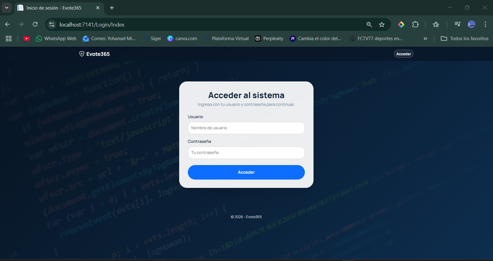
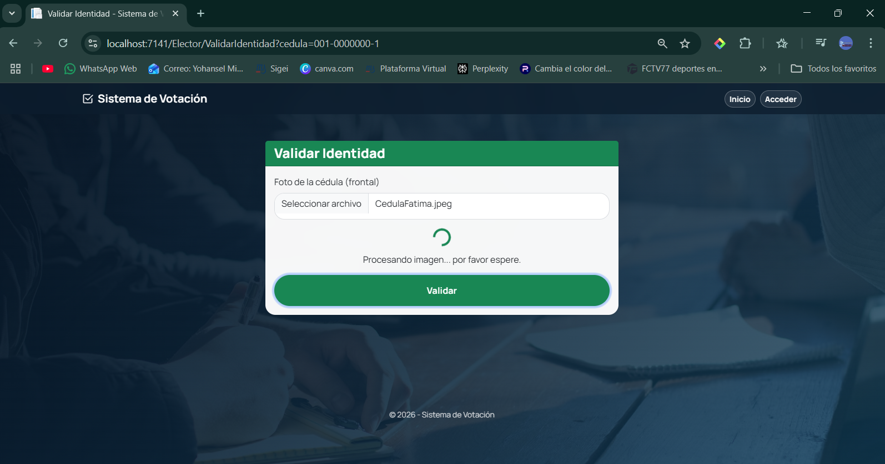
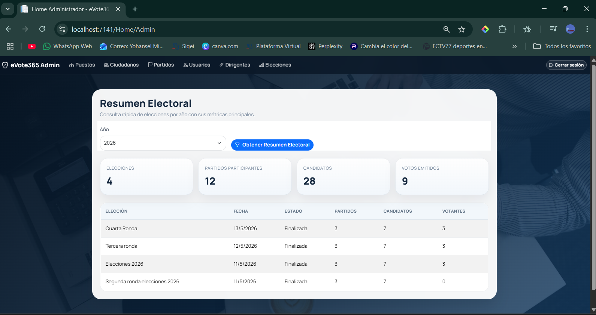
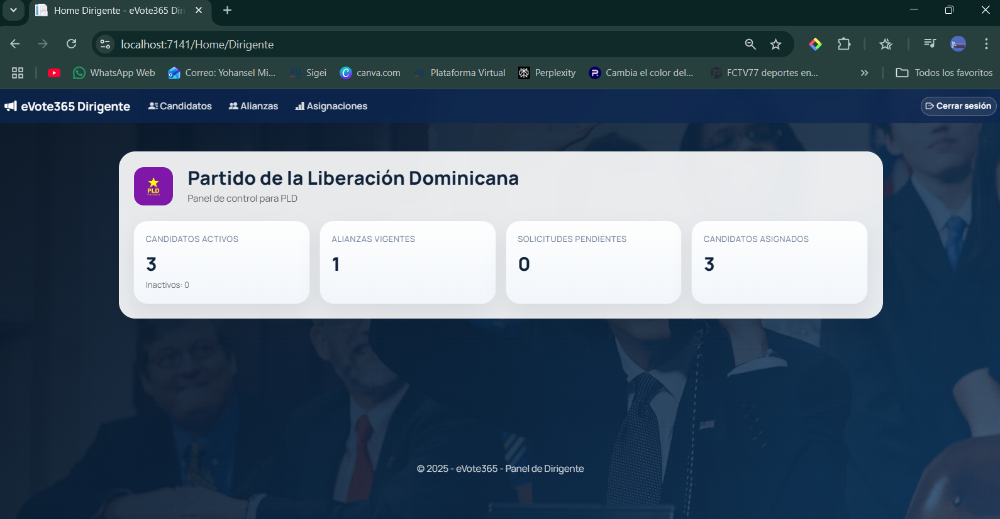
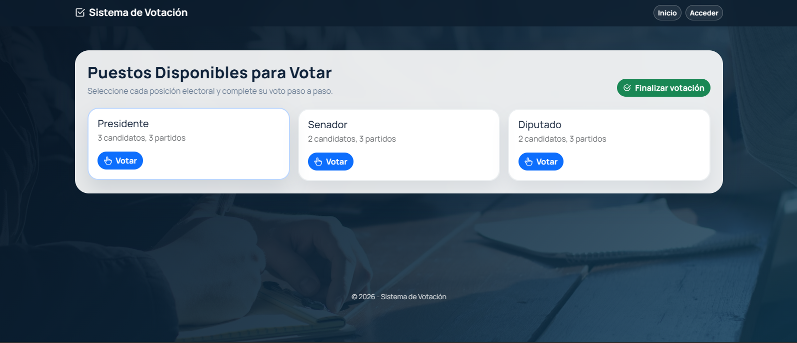
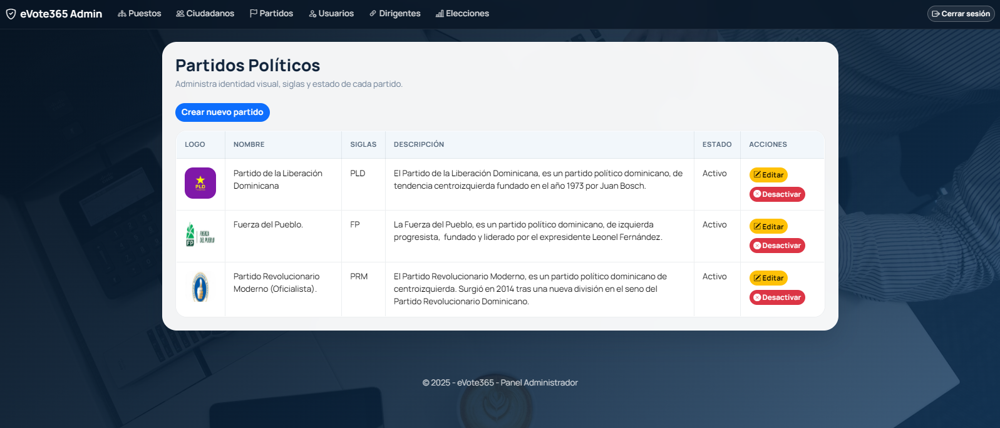
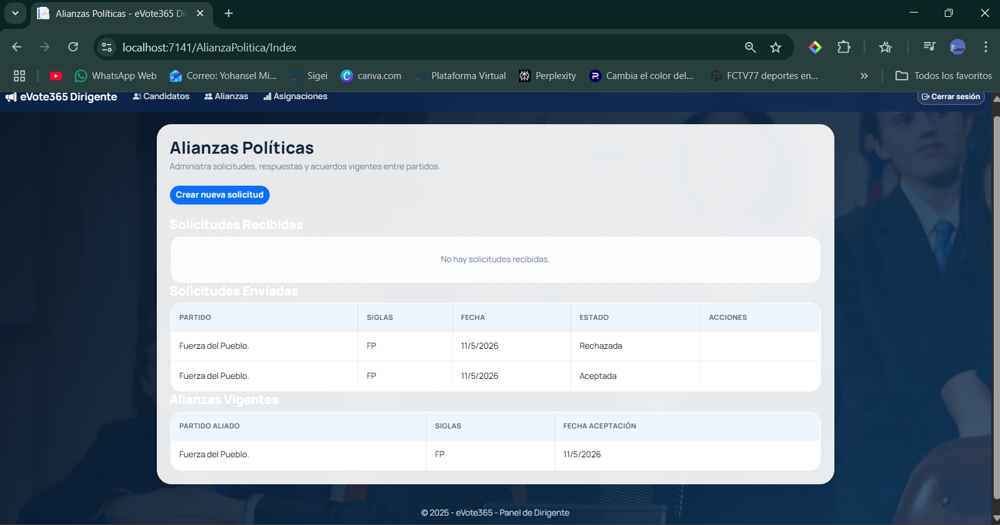
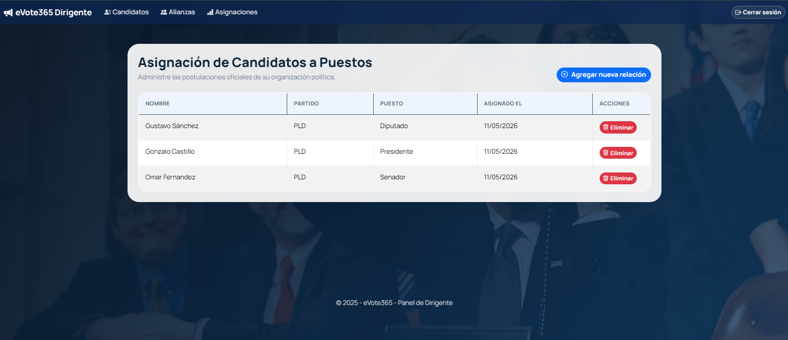
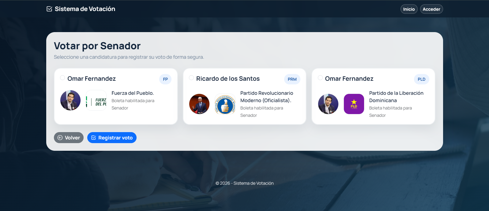
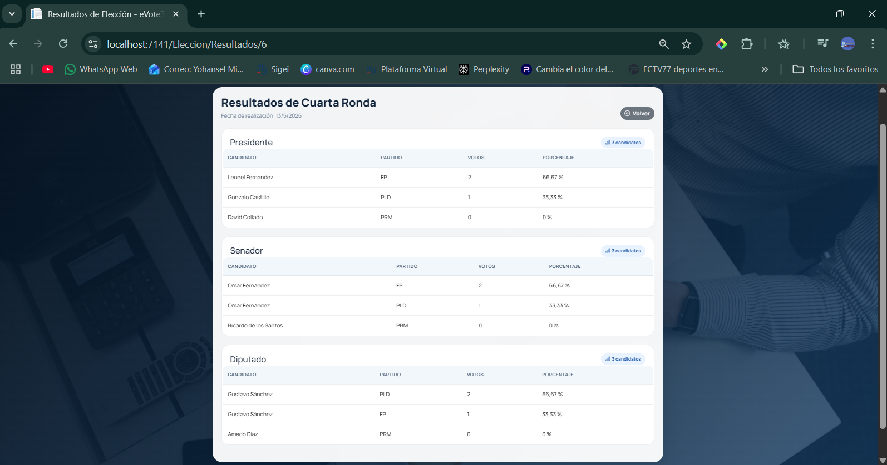

eVote360 - Sistema de Votación Electrónica 🗳️
---
Plataforma web integral para la gestión de procesos electorales, desarrollada en **ASP.NET Core 9.0 MVC** bajo una arquitectura **Onion** y **Entity Framework Core (Code-First)**. El sistema garantiza la seguridad mediante validación de identidad por OCR y un robusto control de alianzas políticas.

 ⚙️ Funcionalidades principales
---
- **Validación de Identidad (OCR):** Carga de imagen de la cédula y procesamiento con el motor **Tesseract OCR** para extraer datos y validarlos contra el registro del ciudadano.
- **Boleta Electoral Inteligente:** Selección de candidatos por puesto electivo, permitiendo diferenciar votos por partidos aunque el candidato sea el mismo en una alianza.
- **Votación Confidencial:** Sistema de emisión de votos con opción de "Ninguno" y validación obligatoria de todos los puestos activos antes de finalizar.
- **Resumen Electoral:** Envío automático de correo electrónico con el resumen de las elecciones realizadas al completar el proceso.
- **Gestión de Alianzas:** Módulo para que dirigentes políticos soliciten y formalicen alianzas, permitiendo postular candidatos de otros partidos.
- **Dashboard de Resultados:** Visualización de ganadores, porcentajes y estadísticas de participación organizadas por año electoral.

 📂 Arquitectura – Onion Architecture
---
- **Application:** Contiene la lógica de negocio, servicios, DTOs, ViewModels y validadores de **FluentValidation**.
- **Domain:** Entidades núcleo del sistema (Voto, Candidato, Ciudadano, Elección), Enums e interfaces de repositorios.
- **Infrastructure:** Persistencia de datos con EF Core, configuración de **Identity**, servicios de Email y el motor de **Tesseract OCR**.
- **WebApp:** Interfaz de usuario construida con **ASP.NET Core MVC** y vistas responsivas utilizando **Bootstrap 5**.

 🔧 Tecnologías usadas
---
- **C# / ASP.NET Core 9.0 MVC**
- **Entity Framework Core (Code-First)**
- **Tesseract OCR** (Procesamiento de imágenes de documentos)
- **AutoMapper** & **FluentValidation**
- **Bootstrap 5 / SweetAlert2 / Toastr** (UI/UX)

📸 Galería del Proyecto
---
En esta sección se presentan las capturas de pantalla que demuestran la funcionalidad y el diseño del sistema.

* Login
  
* Validación de Identidad (OCR)
  
* Home - Administrador
  
* Home - Dirigente Político
  
* Home - Elector
  
* Gestión de Partidos Políticos
  
* Gestión de Alianzas Políticas
  
* Asignación de Candidatos
  
* Proceso de Votación
  
* Resultados de la Elección
  

## 👨‍💻 Equipo de Desarrollo
---
* Yohansel Mieses – miesesyohansel@gmail.com
* Eric Pineda - eccpineda@gmail.com
